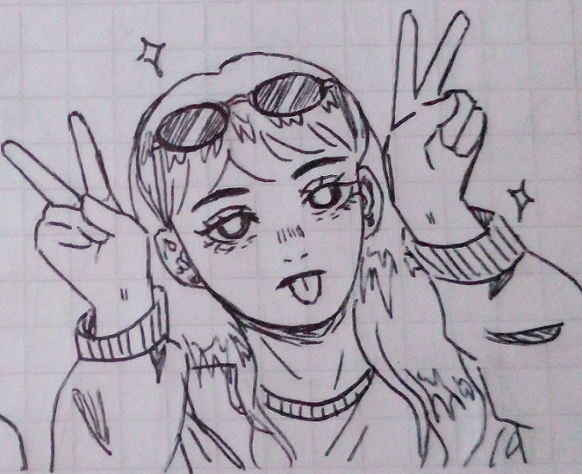

Un dibujo de mi :)

# Presentación Valentina Alvarez

Soy Valentina, tengo 20 años y soy estudiante de la UNAHUR desde el año pasado.

Me interesé en la informática desde que cursaba la secundaria y esa fue una de las principales razones por la que me anoté en esta universidad además de que me quedaba cerca.

Estoy disfrutando cursar las diferentes materias de programación aunque a veces me cuesten un poco jaja.  

## Materias que curso :desktop_computer:
* Programación con objetos 1
* Estructura de datos
* Base de datos

## Otras cosas que me gustan :sparkler:
* Dibujar mientras escucho música.
* Leer comics (manga, manhwa).
* Ver videos de youtube variados.
* Comer comidas dulces.

## Algunos links

* mail <valentiki15@gmail.com>
* instagram <https://www.instagram.com/valu_draws/>
